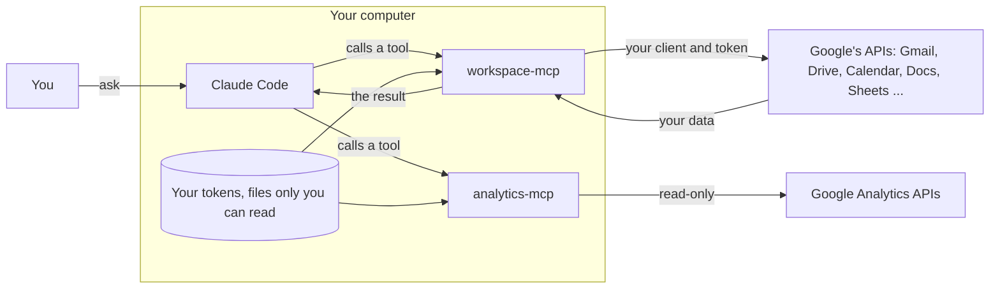

# 00 · The map

Before step 1. Previous: [What Claude already has](00-what-claude-already-has.md). Next: [01 · The project](01-project.md)

Google hands a program your mail only after three things are in place: a project that holds the program, a badge for the program, and your own yes. Steps 1 to 4 build them and steps 5 to 7 connect them to Claude. This page names the parts once, in plain words. Checked against Google's and Anthropic's pages on 2026-10-05.

## The words

- **An API** is a door a program uses to reach an app. Gmail has one, Drive has another. Google keeps each door shut in your project until you open it ([02](02-apis.md)).
- **A project** is the box in Google Cloud that holds your doors, your badge and your consent screen. Google counts every call your program makes against it ([01](01-project.md)).
- **OAuth** is the way Google lets you hand a program part of your account without giving it your password. You sign in on Google's own page, and Google gives the program a token.
- **A scope** is one slice of your account a program may touch, such as reading your mail or editing your spreadsheets. The server asks for the scopes its tools need.
- **The consent screen** is the page where Google shows you who's asking and for which scopes, and where you say yes. In the Google Cloud console its settings sit under "Google Auth platform" ([03](03-consent.md)).
- **The client ID and client secret** are the program's badge and its password. The ID tells Google which program is asking. The secret proves it. Together they're the client ([04](04-client.md)).
- **A token** is what Google gives back after your yes: a long string that lets the program act as you, inside the scopes you allowed. It lands in a file on your computer that only you can read ([07](07-first-call.md)).
- **MCP**, the Model Context Protocol, is the plug between Claude and other programs. A program that speaks it is an MCP **server**; each action it offers is a **tool**. Claude Code calls a tool, the server does the work and sends back the result ([06](06-install.md)).
- **The servers** here are two. [workspace-mcp](https://github.com/taylorwilsdon/google_workspace_mcp), an open-source MCP server for Google's Workspace apps, offers 112 tools with this kit's ten default services, such as `search_gmail_messages` and `create_spreadsheet` (version 2.0.1). Google's own [analytics-mcp](https://github.com/googleanalytics/google-analytics-mcp) offers 9 read-only tools for Google Analytics, such as `run_report` (version 0.7.0). Both counted on 2026-10-05.

## The path of one request

The first time, there's one more loop. The server has no token yet, so `./auth` has it open Google's sign-in in your browser. Google asks whether this app may use the scopes listed. You say yes. Google sends your browser back to `http://localhost:8000/oauth2callback`, an address on your own computer where the server is listening, and the server saves the token. From then on the server uses the token and you see no sign-in, until Google ends it ([03](03-consent.md) says when). Analytics gets its own read-only sign-in the same way, through `./auth-analytics`, and its own file.

## Where each part lives

| Part | Where | Made in |
|---|---|---|
| Project, APIs, consent screen, client | Google Cloud console, in your account | [01](01-project.md) to [04](04-client.md) |
| Admin trust, for Workspace accounts | Google Admin console, by your admin | [05](05-admin.md) |
| The two server programs | `~/.local/bin/workspace-mcp` and `~/.local/bin/analytics-mcp`, installed by uv | [06](06-install.md) |
| Your client ID, secret and address | `~/.config/google-doors/<account>/config`, readable by you alone | [06](06-install.md) |
| Your token | `~/.config/google-doors/<account>/tokens/<address>.json`, readable by you alone | [07](07-first-call.md) |
| Your Analytics sign-in | `~/.config/google-doors/<account>/analytics.json`, readable by you alone | [07](07-first-call.md) |
| Claude Code's entries for the servers | `~/.claude.json`, under the names `google` and `analytics` | [06](06-install.md) |
